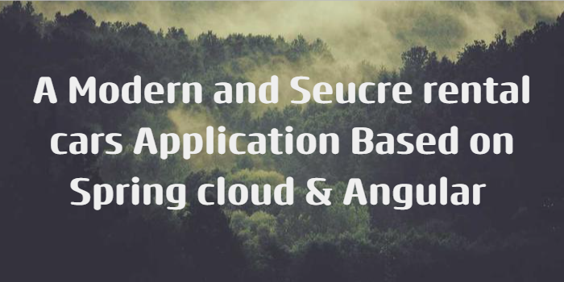

# Rental Cars Application Based on Microservices Architecture
## 🔗 Links

This project is designed to allow users to book and manage their car rentals through a rental car application. The application is built using a microservices architecture and incorporates several tools and technologies of Spring Cloud for the backend and Angular 13 for the frontend. The main objective of this project is to help developers become more familiar with Microservices Architecture and to provide them with easy access to the most important configurations required to build microservices-based applications using Spring Cloud.

## Rental Cars Services:
- [x] cars-services
- [x] notification-service
- [x] customers-service
- [x] orders-service
- [x] offices-service

## tools & techs

#### Routing All Microservices Requests :
* Spring cloud Gateway
#### Service Discovery :
* Consul Server
#### Secret Management :
* Vault Server

####  Inter Service Communication :
*  openfeign (sync Communication)
*  web clients (sync / async Communication)

#### Resilient Communication :
* Circuit Breaker
* Resilience4J

#### Distributed Tracing :
* Micrometer Tracing & Zipkin
    * Tracing — seeing WHAT happened
    * Metrics — seeing HOW LONG it took to happen

#### unit & integration test (orders-service) :
* JUnit
* Mockito

#### storing and serving distributed configurations across all service :
* Spring Cloud Config

#### Event streaming
* Kafka Broker
#### Zero Trust Security Architecture :
* Spring Security
* Keycloak (Open Source Identity Manager And Access Management) covered two clients :
    1.  rental-cars-clients : for backend to (authenticate you will need to provide symetric key + user credentials)
    2. rental-cars-front :  you will need only user credentials as it isn't secure to store symetric key in the front (people can access it from js )
#### Monitoring
* Prometheus & Grafana
####  Databases :
* MySQL MaeriaDB
* MongoDB
* PostgresDB
* Oracle ( if you have installed in your host machine)
#### Front End (two app , one for clients & the other for admin):
* Angular 13
* Bootstrap 5
* HightCharts to visualize admine data
* Admin app secured with keycloak

#### containerization
* Docker
* Docker-Compose
## Acknowledgements

- [Awesome Readme Templates](https://awesomeopensource.com/project/elangosundar/awesome-README-templates)
- [Awesome README](https://github.com/matiassingers/awesome-readme)
- [How to write a Good readme](https://bulldogjob.com/news/449-how-to-write-a-good-readme-for-your-github-project)

## Appendix

Any additional information goes here

## Authors

- [@octokatherine](https://www.github.com/octokatherine)

## All-Ports
| service               |Ports|
|-----------------------| ---|
| orders-service        |8081|
| cars-service          |8082|
| customers-service     |8083|
| offices-service       |8084|
| consul-config-service |8085|
| notification-service  |8086|
| config-service        |8888|
| gateway-service       |9999|
| zipkin-server         |9411|
| vault-server          |8200|
| keycloak-service      |8080|
| promethues            |9090|
| grafana               |3000|
| zookeeper             |2181|
| kafka                 |9092|

oracle db config :

