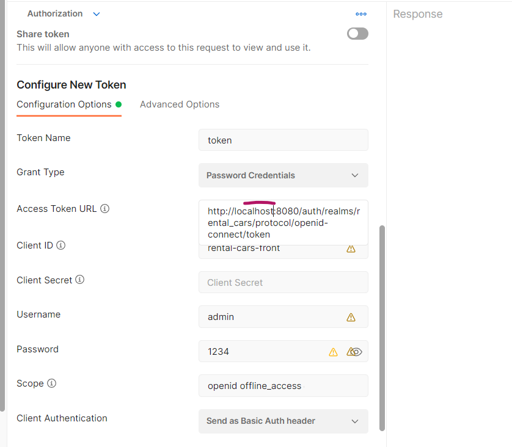
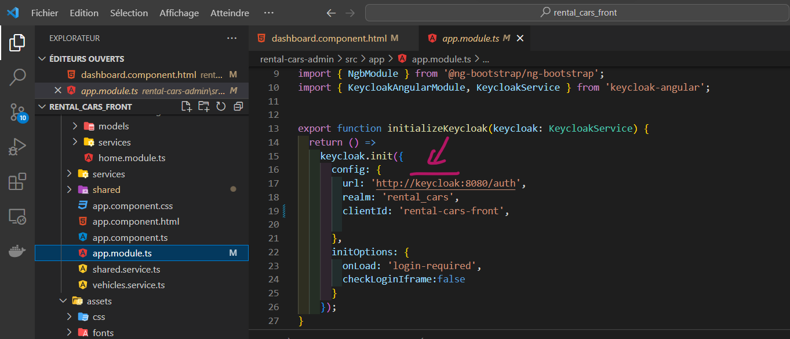
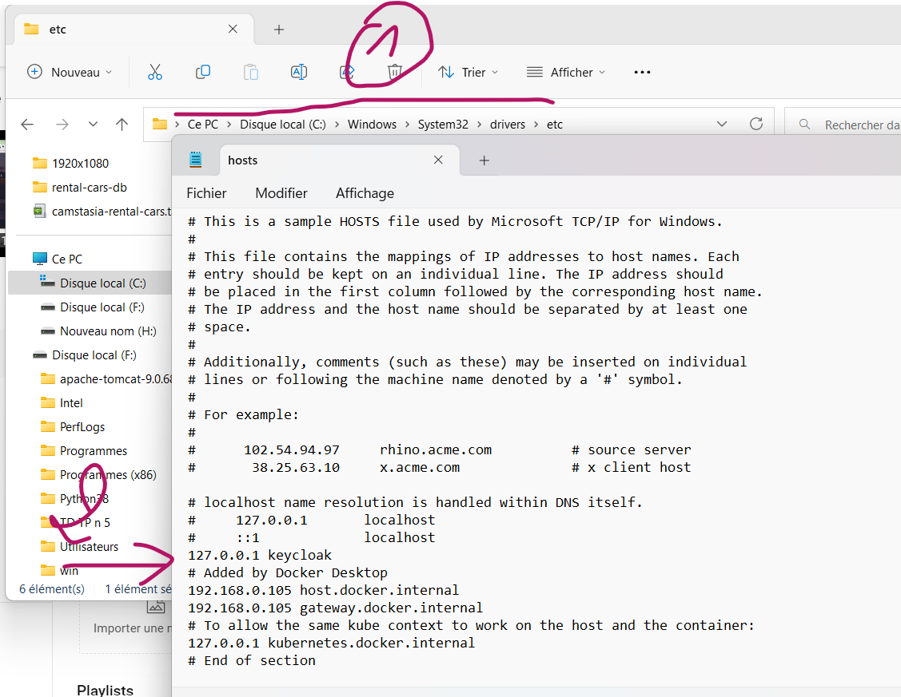

#  A modern and secure rental cars application based on Microservices Architecture 


<div align="center">


</div>


<!--  -->
### Functional Analyses : 
<p>The objective of this project is to enhance the car rental searching for clients by implementing multiple search filters such as vehicle model, name, category, minimum and maximum price and much more informations about the company . The application allows clients to contact the owner and also enables the owner to manage his vehicles, offices, employees, and orders through an hierarchical architecture. The offices are organized with their respective employees and vehicles, which the admin can manipulate . Additionally, the admin can appoint specific office admins with limited dashboard access to manage the vehicles of their specific offices.</p>

<p>
 The application is built with a microservices architecture and incorporates several tools and technologies of Spring Cloud for the backend and Angular 13 for the frontend. The main objective of this project is to help  to get familiar with  microservices architecture,It covered the most important configurations required to build microservices-based applications using Spring Cloud , I have dockerized all services and organised them on docker compose , so with one click you can run all application .
 below 
</p>
<p> <bold> scroll down to see all tech used</bold> </p>


### Demo  __click on the link below__ :
 
<div align="center" >

<a style href="https://www.youtube.com/watch?v=SjwAfaMUZKg&ab_channel=IsmailForeveryone" >

<p>Click here to see full demo</p>
</a>

<!-- [](https://www.youtube.com/watch?v=SjwAfaMUZKg&ab_channel=IsmailForeveryone) -->
</div>


### Class Diagram : 
<div  align="center"  >

</div>


## Backend Services:
- [x] cars-services
- [x] notification-service
- [x] customers-service
- [x] orders-service
- [x] offices-service


## tools & techs

#### Routing All Microservices Requests :
* Spring cloud Gateway
#### Service Discovery :
* Consul Server
#### Secret Management :
* Vault Server

####  Inter Service Communication :
*  openfeign (sync Communication)
*  web clients (sync / async Communication)

#### Resilient Communication :
* Circuit Breaker
* Resilience4J

#### Distributed Tracing :
* Micrometer Tracing & Zipkin
  * Tracing — seeing WHAT happened
  * Metrics — seeing HOW LONG it took to happen

#### unit & integration test (orders-service) :
* JUnit
* Mockito

#### storing and serving distributed configurations across all service :
* Spring Cloud Config

#### Event streaming
* Kafka Broker
#### Zero Trust Security Architecture :
* Spring Security
* Keycloak (Open Source Identity Manager And Access Management) covered two clients :
  1.  rental-cars-clients : for backend to (authenticate you will need to provide symetric key + user credentials)
  2. rental-cars-front :  you will need only user credentials as it isn't secure to store symetric key in the front (people can access it from js )
#### Monitoring
* Prometheus & Grafana
####  Databases :
* MySQL MaeriaDB
* MongoDB
* PostgresDB
* Oracle ( if you have installed in your host machine)
#### Front End (two app , one for clients & the other for admin):
* Angular 13
* Bootstrap 5
* HightCharts to visualize admine data
* Admin app secured with keycloak

#### containerization
* Docker
* Docker-Compose


## Usage :

### To build docker images ,make sure to replace to each service directory and  run for each one this commands :
<p>First clone projects  </p>

```bash

[//]: # (Admin dashboard)
git clone https://github.com/Ismailharik/rental-cars-admin.git

[//]: # (Clients interface )
git clone https://github.com/Ismailharik/rental-cars-front.git

[//]: # (backend services)
git clone https://github.com/Ismailharik/rental-cars.git
```
<p> Build Image for your backend service or </p>

```bash
docker build -t orders-service .
docker build -t gateway-service .
docker build -t customers-service .
docker build -t notification-service .
docker build -t offices-service .
docker build -t orders-service .
docker build -t config-service .
docker build -t consul-config-service . 
# then you can run the cmd below to run all application
docker-compose up
```
#### To test the endpoints from postman 

##### make sure to add on the request header this authorization : 
  <span>If you want to test backend services with rental-cars-client , make sure to add client secret </span>
  * To run them without docker you will need to  update host name of keycloak to localhost :
  * inside postman 
  * admin dashboard  to localhost : 
  * late DNS know keycloak hostname , got to  hosts file : 


### All-Ports
<p>Services  Ports : </p>


| service               | Ports |
| --------------------- | ----- |
| orders-service        | 8081  |
| cars-service          | 8082  |
| customers-service     | 8083  |
| offices-service       | 8084  |
| consul-config-service | 8085  |
| notification-service  | 8086  |
| config-service        | 8888  |
| gateway-service       | 9999  |
| client interface      | 4201  |
| admin dashboard       | 4200  |


<p>Tools  Ports : </p>

| service          | Ports |
| ---------------- | ----- |
| zipkin-server    | 9411  |
| vault-server     | 8200  |
| keycloak-service | 8080  |
| promethues       | 9090  |
| grafana          | 3000  |
| zookeeper        | 2181  |
| kafka            | 9092  |

## 🔗 Links
[](https://www.linkedin.com/in/ismail-harik-241b371b9/)
[](https://www.linkedin.com/in/ismail-harik-241b371b9)
[](https://twitter.com/ismail_harik)


### Change offices db from Postgres to Oracle

If you have installed oracle db in your machine and want to use it make sure to uncomment it's dependency & config from offices service & comment postgres :


### related projects :

<a href="https://github.com/SaiUpadhyayula/spring-boot-microservices-new">SaiUpadhyayula/spring-boot-microservices-new</a> <br>
<a href="https://github.com/Aliot26/microservices_v3">Aliot26/microservices_v3</a> <br>
<a href="https://github.com/in28minutes/spring-microservices">in28minutes/spring-microservices</a>

